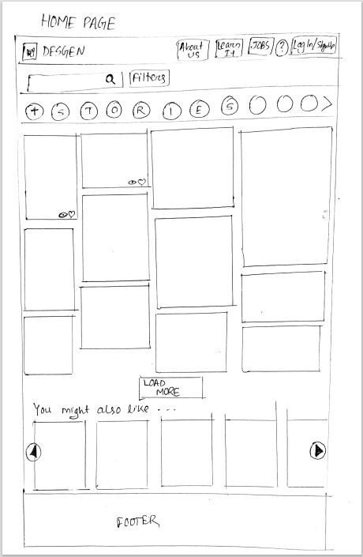
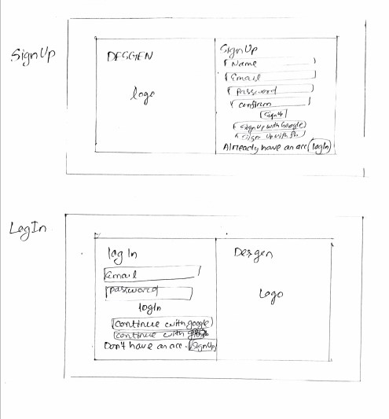
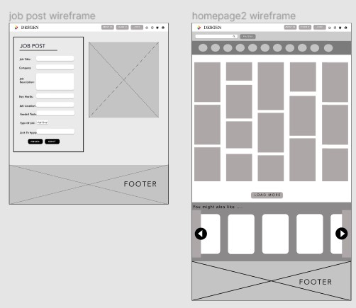
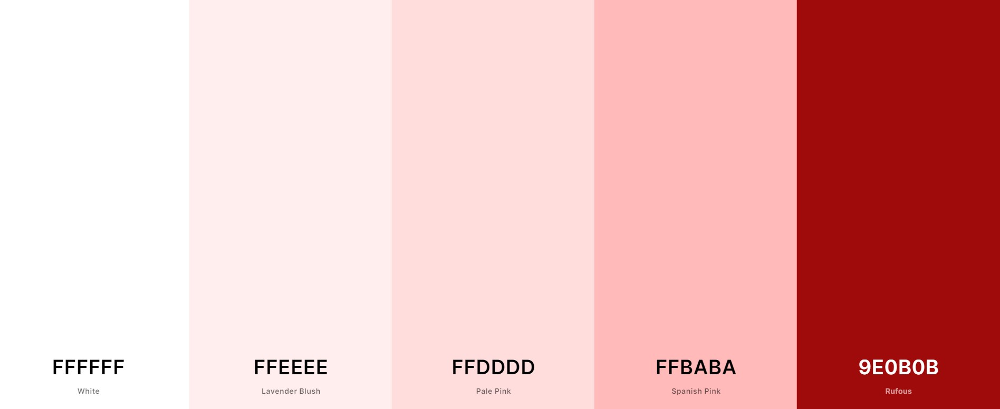
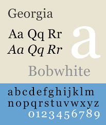
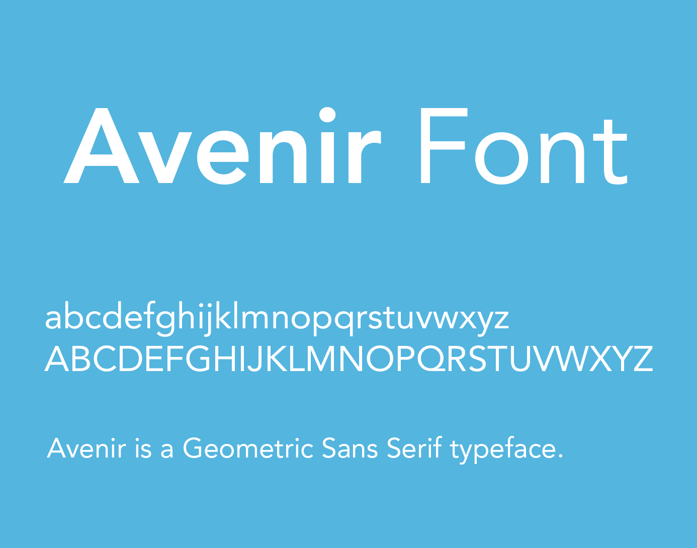
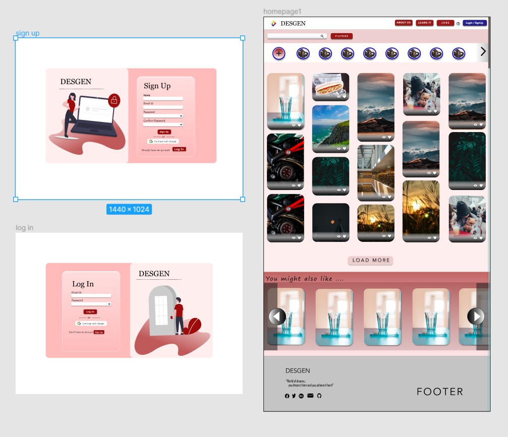

“DESGEN”: UX case study

1. Understanding The Challenge

“INTERNET” The boundless world of knowledge and inspiration has become our only hope in this pandemic. There are many social media platforms, many educational sites and the list goes on. Even an artist looking for inspiration need not step out. There are websites that will not only help you with your inspiration  but also lets you inspire others through your work. There are educational platforms that provide us with limitless learning. The Internet has it all. BUT the most common problem faced by people is the time it takes while surfing through different websites.
For instance let's say a designer is looking for inspiration and finally he finds one. Then he moves to another website to create his own design. Then he shifts to another platform to share his work to know what people think about it. 
 What if he could get it all on one platform? 
That’s the DESGEN we want to create. A platform with all the facilities. 
“A platform that helps you learn, teach, inspire , create and share.” And finally with all those skills you can even look for your jobs right there. 
Amazing RIGHT? All in one website !

2. Research Method

We began with the existing websites, looked around and noted down their best parts as well as what they needed to make the user more satisfied. Every website has its best features that made it stand out of the crowd. 
The conclusion after our first phase of research was that most websites are focused on either hiring and job section or some are completely providing inspiration to the users for their designs.
The websites that grew the most traffic were those who tried to provide users with most of the needed facilities at one place. 

Then the focus of our research was shifted to the kingpin of  a website “The USER”. After talking to the users of the above website from different domains about their experience and expectations on future improvements in the website, the final ideation of the team was created that concluded our research for the website.

3. Finalising the Features

After the long tiring research we knew what we were aiming to create . so the features that were going to be the part of the websites were finalised by the team. 

Walk through 
Sign Up/Log In
Profile, individual account
Homepage
Search bar
Bar at top
Search bar with filters
following stories
Notifications 

Body containing design ideas
Connect to people 
    a   Community discussion forum
    b   Notice forums
    c   Chat groups
    d   Private chat
Job section
Learning section

4. User Flowchart

With the basic ideation of what our website’s main features are , the flowchart of the website was created.
Having all those features in mind we had to be sure that features should be crisp and clear for the users.
To view the user flowchart in detail, go to https://drive.google.com/drive/folders/1gX3qUzOZdRNS0R_pUhu0n7_jfzyAxmNj?usp=sharing 
5. Sketches

The first outline of the website was created after all the ideation and thought . Our team poured in a lot of  imagination and creativity to design the primary look of the website.  
The main challenge creating this was to provide users with everything they needed without any hassle.

6. Wireframes

The sketches were finally drafted into wireframes. The first digital layout of our website.

7. Visual Research

 7.1 Colour Palette
         
          Primary colours:

The primary colour we used is PALE PINK (FFDDDD).  Pink gives off a creative and artistic vibe. It is thought to have a calming effect. We added neutral colors for text, icons and to create contrast for important elements, or as background colors.

          Secondary colours:

The secondary colours we used were shades of blue. Its also a calming colour which symbolises reliability. Its mostly used in educational websites. And as a contrast white font was used on it. Additionally, we used black for the text and included a great deal of white to give a calm and clean appearance. The headings are in blue colour as it builds trust among the audience.

7.2 Typography

We had decided to go with Georgia (Regular) of the Serifs as our primary font and Avenir LT Std as our secondary font. Avenir is from the Sans Serif’s family. Generally, Serif and Sans serif work very well in harmony. So we picked fonts from these families that seemed to go well with Desgen.

 
 
                        
8. Design

The main goal of Desgen i.e to ease the communication gap between like minded people, to create a platform where designers can create, share, get inspired, learn different skills was eased through discussion forums, groups, and by connecting people. Here are the final designs of Desgen:
 
 Here is the link to view all designs in detail: https://www.figma.com/file/lJbAUaImGQZfHRKvc79unJ/Untitled?node-id=0%3A1

